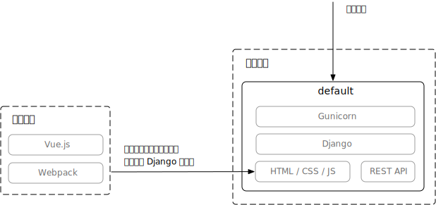
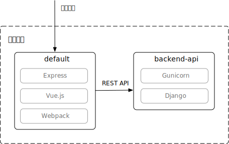

# 蓝鲸应用多模块功能简介

## 什么是“多模块”

“模块”和“蓝鲸应用”类似，是蓝鲸 PaaS3.0 开发者中心里的一个概念。

每一个蓝鲸应用都拥有至少一个模块：**default（默认模块）**，当你完成应用创建时，这个 default 模块就存在了。

模块是增强服务、源码仓库、部署环境这些应用资源的直接载体。

从某种意义上来说，这些资源不直接属于应用，而是属于应用的 default 模块。

除了 default 模块外，你也可以在应用下创建新的模块。新模块将会拥有一套和 default 完全隔离的资源。

通过应用内页上方的下拉菜单，你可以灵活的在模块之间切换。

## 为什么要使用“多模块”

对于绝大多数蓝鲸应用来说，一个 default 模块就可以满足所有需求了。

但是想象一下这个场景：你有一个前后端分离的 Web 应用，前端使用 webpack + vue.js 实现，后端则是 Python + Django 的 REST API。

那么，假如只使用一个 default 模块，你会发现根本没法用正常的方式把应用部署上去。你只能预先在本地开发环境把前端编译成静态文件，然后把把它们外挂到后端 Django 项目中提供访问。

图：单模块部署前后端分离项目

多模块功能就是为了解决这类问题而诞生的。像上面这种前后端分离的项目，你可以创建多个模块来完成真正的前后端分离架构：

- default 模块：用于存放前端相关代码，使用 nginx 托管前端静态页面
- backend-api 模块：用于存放后端 API 相关代码，直接用 gunicorn 处理请求

图：前后端分离多模块

使用多模块功能，我们可以让两个模块独立开发、部署，实现真正的前后端分离。

除了前后端分离的应用之外，多模块功能还适用任何需要把应用功能通过模块拆分，并基于网络协议通信的架构。比如实践业界流行的“微服务架构”应用。

## 应用资源如何通过模块隔离

应用内的绝大多数资源都是基于模块隔离的，比如模块所绑定的源码仓库地址、所申请的增强服务示例等。

当你在应用内页切换了当前模块后，访问这些功能页面就会展示当前这个模块的情况。

但应用内同样存在一些不是基于模块隔离的功能，比如 **成员管理**。如果你将某个人添加为应用成员，那他就可以操作应用下的所有模块。和成员管理一样，**基本信息、云 API 权限** 功能也不区分模块。

值得注意的是，**应用市场** 功能同样也不区分模块。同一个应用，无论下面创建了多少个模块，都只能作为 **一个应用** 在蓝鲸市场上架。

那么当一个拥有多个模块的应用在市场上架后，用户通过蓝鲸桌面点击应用图标，会打开其中的哪一个模块呢？答案是 **“主模块”** 。

## 什么是“主模块”

一个应用可以创建很多模块，但是只能拥有一个主模块。默认情况下，default 模块就是应用的主模块。主模块意味着：

1. 应用的快速访问地址 （比如应用列表页的“访问”按钮） 将指向主模块各环境地址
2. **应用在蓝鲸应用市场访问地址将指向主模块的生产环境地址**
3. 应用移动端访问地址将指向主模块的生产环境地址
4. 应用短域名主访问地址将会指向到主模块的生产环境

当你切换了应用主模块后，上面的三个地址所指向的模块就会发生变化。如果你应用的绝大多数客户都使用上面这些短域名访问应用，那么当你进行主模块切换时请额外当心。

### 如何切换主模块

进入应用详情页，点击左侧导航的 “模块管理” 菜单，进入页面后首先切换到你想要设置为 “主模块” 的模块，然后点击页面中的 “设置该模块为主模块” 按钮即可完成主模块切换。
